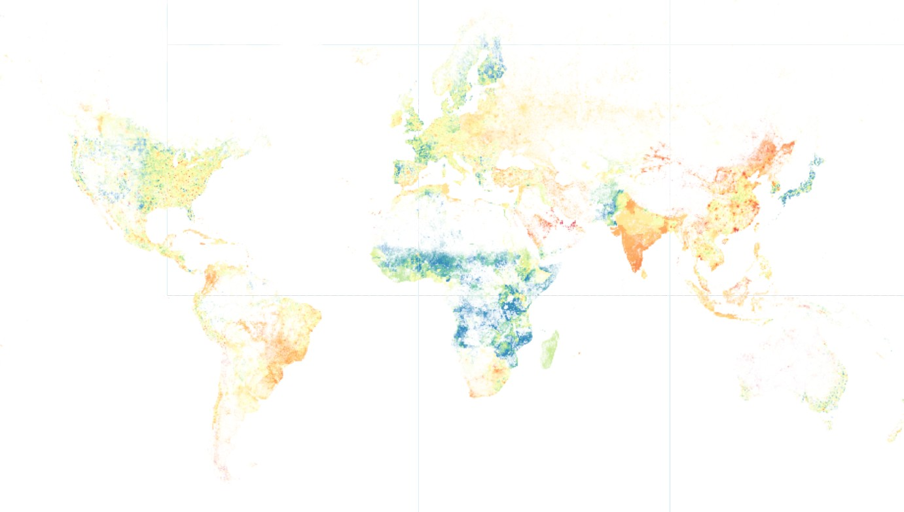

# Worldpop Global Demographic Data on GEE

WorldPop just released a new Global Demographic Data covering 2015 and 2030. This gridded population estimate at 1-km resolution is produced using a Random Forest disaggregation model, which is trained using updated covariates and census data to provide high-resolution, contemporary, and future population distributions essential for applications like disaster response, urban planning, and health resource allocation.

The primary data, including the gridded population estimates (2015 and 2030 at 100-km resolution), can be directly downloaded from the official [WorldPop website](https://hub.worldpop.org/project/categories?id=3) and the [Humanitarian Data Exchange (HDX)](https://data.humdata.org/organization/worldpop), making them readily available for general use and humanitarian applications.

The total population dataset at the original 100-meter resolution is accessible via the Google Earth Engine (GEE) platform. This is hosted as a curated [public catalog](https://gee-community-catalog.org/projects/worldpop/) by Samapriya Roy, allowing researchers to leverage GEE's cloud-based computing power for large-scale analysis without needing to download massive files. The age-sex structure data is available on [GEE](https://code.earthengine.google.com/?asset=projects/wpgp-global2/assets/agesex_100m).

Along with that, [total population](https://code.earthengine.google.com/?asset=projects/wpgp-global2/assets/pop_1km_ua) and [age-sex structure](https://code.earthengine.google.com/?asset=projects/wpgp-global2/assets/agesex_1km_ua) at 1-km resolution are also available on GEE and ready for use.

### Data description
Data | Resolution | Bands | Remarks 
--- | --- | --- | ---
Total population | 100 m | 1 band: population | Stored per country
Total population | 1 km | 1 band: population | Global mosaic divided into 1216 tiles
Age-sex structure | 100 m | 40 bands: f_00, f_01, f_05, ..., f_90, m_00, m_01, ..., m_90 | Stored per country
Age-sex structure | 1 km | 40 bands: f_00, f_01, f_05, ..., f_90, m_00, m_01, ..., m_90 | Global mosaic divided into 1216 tiles

### Key assets
Data | Resolution | Link to data 
--- | --- | ---
Total population | 100 m | https://code.earthengine.google.com/?asset=projects/sat-io/open-datasets/WORLDPOP/pop
Total population | 1 km | https://code.earthengine.google.com/?asset=projects/wpgp-global2/assets/pop_1km_ua
Age-sex structure | 100 m | https://code.earthengine.google.com/?asset=projects/wpgp-global2/assets/agesex_100m
Age-sex structure | 1 km | https://code.earthengine.google.com/?asset=projects/wpgp-global2/assets/agesex_1km_ua


### Simple usage:
```js
var year = "2020";
// total population at 100-m resolution
var total_100m = ee.ImageCollection("projects/sat-io/open-datasets/WORLDPOP/pop")
	.filterDate(year + "-01-01", year + "-12-31");

// total population at 1-km resolution
var total_1km = ee.ImageCollection('projects/wpgp-global2/assets/pop_1km_ua')
  .filterDate(year+'-01-01', year+'-12-31').mosaic();

// age-sex structure at 1-km resolution
var agesex_1km = ee.ImageCollection('projects/wpgp-global2/assets/agesex_1km_ua')
  .filterDate(year+'-01-01', year+'-12-31').mosaic();
```

### Visualising dependency ratio
In this example, we calculate and display global dependency ratio in 2025. Dependency ratio is a demographic measure that compares the number of non-working individuals (children and the elderly) to the number of working-aged individuals in a population. In this case, non-working individuals fall between 0-15 and 65+ age groups.

```js
var year = '2025';
var get_bands = function(bands){
  bands = ee.List(bands);
  var f = bands.map(function(b){return ee.String('f_').cat(ee.Number(b).format('%02d'))});
  var m = bands.map(function(b){return ee.String('m_').cat(ee.Number(b).format('%02d'))});
  return ee.List(f).cat(m);
};

var bands_young = get_bands([0,1,5,10]);
var bands_prod = get_bands(ee.List.sequence(15,60,5));
var bands_old = get_bands([65,70,75,80,85,90]);

var agesex = ee.ImageCollection('projects/wpgp-global2/assets/agesex_1km_ua')
  .filterDate(year+'-01-01', year+'-12-31').mosaic();

var pop_young = agesex.select(bands_young).reduce('sum');
var pop_prod = agesex.select(bands_prod).reduce('sum');
var pop_old = agesex.select(bands_old).reduce('sum');
var dependency = pop_young.add(pop_old).divide(pop_prod);

var palettes = require('users/gena/packages:palettes');
var palette = palettes.colorbrewer.Spectral[9];

Map.addLayer(dependency, {min:0.2, max:1, palette:palette}, 'dependency');
```



### Suggested citation:
Bondarenko M., Priyatikanto R., Tejedor-Garavito N., Zhang W., McKeen T., Cunningham A., Woods T., Hilton J., Cihan D., Nosatiuk B., Brinkhoff T., Tatem A., Sorichetta A.. 2025. The spatial distribution of population in 2015-2030 at a resolution of 30 arc (approximately 1km at the equator) R2025A version v1. Global Demographic Data Project - Funded by The Bill and Melinda Gates Foundation (INV-045237). WorldPop - School of Geography and Environmental Science, University of Southampton. [DOI: 10.5258/SOTON/WP00845](https://doi.org/10.5258/SOTON/WP00845).